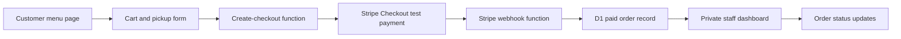

# Food Truck Online Ordering Project Guide

## Purpose

This is a practice project for learning how the visible parts of a website
connect to backend code, saved data, third-party payment confirmation, and a
second device used by staff.

We are deliberately building a small version ourselves. Stripe will handle
secure card entry; Cloudflare will host the site, backend functions, and
database; we will write the order workflow and staff dashboard.

## User Story

### Primary Customer Story

As a hungry customer, I want to view a food truck menu, select items, submit
my pickup information, and securely pay online so that my paid order is sent
to the food truck for preparation.

### Primary Staff Story

As a food truck worker, I want to open a private order dashboard on a tablet or
laptop and see newly paid online orders in arrival order so that I can prepare
and mark orders through their working states.

### Learning Story

As the developer, I want to build each part in small working stages so that I
understand hosting, API requests, databases, payment webhooks, and displaying
saved data on another device.

## Final Product Definition

The first completed product is successful when:

- A customer visits the public website on a phone or computer.
- The customer chooses menu items and enters pickup/contact information.
- The customer completes a Stripe Checkout payment.
- The backend accepts a verified Stripe webhook and stores one paid order.
- A protected staff dashboard on another device displays the new paid order.
- Staff can move an order through `new`, `preparing`, `ready`, and `completed`.
- A repeated payment webhook does not create a duplicate order.

## Not Part Of Version One

These are good future features, but are intentionally excluded until the core
flow works:

- Live payment processing for a real business.
- Printer or point-of-sale integration.
- Customer accounts.
- Text-message notifications.
- Inventory or sold-out administration.
- Custom staff username/password storage.
- Real-time WebSockets.

## Chosen Stack

| Concern | Choice | Reason |
| --- | --- | --- |
| User interface | HTML, CSS, vanilla JavaScript | The browser and HTTP flow stay visible while learning. |
| Source control | GitHub repository | Supports history and Cloudflare deployment connection. |
| Static hosting | Cloudflare Pages | Fits a static site and connects to GitHub. |
| Server-side endpoints | Cloudflare Pages Functions | Adds backend behavior without managing a server. |
| Stored orders | Cloudflare D1 | Simple managed SQL storage within Cloudflare. |
| Payment collection | Stripe Checkout in test mode | Stripe handles card entry while we handle order logic. |
| Staff access protection | Cloudflare Access | Avoids building insecure custom authentication first. |
| New order updates | Five-second polling | Simple and adequate for the first working dashboard. |

## Intended Order Flow



## Build Instructions

Each phase ends with a testable result. Do not begin live payments or expose a
real business workflow until all test-mode behavior is understood and tested.

### Phase 0: Establish the Local Project

- [x] Create a project folder.
- [x] Initialize a local Git repository using the `main` branch.
- [x] Add this project guide and a progress/save-point document.
- [x] Add the initial static site scaffold.
- [x] Open the static page locally and confirm it renders.
- [ ] Make the first Git commit after reviewing the new files.

Result: a documented local project with an initial site ready for version
control history.

### Phase 1: Establish the GitHub Repository

- [ ] Create an empty GitHub repository for this project.
- [ ] Add that GitHub repository as the local `origin` remote.
- [ ] Push the local `main` branch to GitHub.
- [ ] Confirm that secret files such as `.dev.vars` and `.env` are ignored.

Result: the project has a remote source-of-truth repository that Cloudflare
can use for deployment.

### Phase 2: Deploy the Static Website to Cloudflare Pages

- [ ] Create a Cloudflare Pages project connected to the GitHub repository.
- [ ] Configure the deploy output to serve the files from `public/`.
- [ ] Deploy the static site with no backend behavior yet.
- [ ] Open the public Pages URL on a phone and a computer.
- [ ] Confirm the menu and cart interface loads on both devices.

Result: the customer-facing static site is available online through
Cloudflare, but it does not submit real orders.

### Phase 3: Complete the Browser-Only Menu and Cart

- [ ] Define a small hardcoded menu in JavaScript with prices in cents.
- [ ] Add and remove items from a cart.
- [ ] Calculate quantity and total correctly.
- [ ] Collect customer name, phone, pickup preference, and order notes.
- [ ] Validate required inputs in the browser for user feedback.
- [ ] Keep checkout disabled or simulated until backend validation exists.

Result: customers can assemble an order in their browser, but no trusted order
is created yet.

### Phase 4: Add the First Cloudflare Backend Function

- [ ] Learn the Pages Functions folder convention for API endpoints.
- [ ] Create a simple health/check endpoint such as `GET /api/health`.
- [ ] Deploy it and confirm the public site can request it successfully.
- [ ] Add a `POST /api/orders` prototype endpoint for fake orders only.
- [ ] On the server side, validate allowable menu item IDs and calculate
      prices again instead of trusting totals sent by the browser.

Result: the public website can send data to code running on Cloudflare, and
the backend understands the difference between trusted and untrusted values.

### Phase 5: Create D1 Storage for Fake Orders

- [ ] Design the smallest order table required for the fake-order phase.
- [ ] Review and approve the schema before creating or migrating the database.
- [ ] Create a D1 development database and bind it to the Pages project.
- [ ] Add a migration for an `orders` table.
- [ ] Store submitted fake orders with a `new` status.
- [ ] Query the saved orders through an API endpoint.
- [ ] Keep fake orders visibly labeled as unpaid/test data.

A simple starting shape to review before implementation:

```text
orders
  id
  customer_name
  customer_phone
  pickup_option
  notes
  items_json
  total_cents
  payment_status
  order_status
  stripe_checkout_session_id
  created_at
```

Result: an order submitted from the public device persists in a database and
can be retrieved later.

### Phase 6: Build the Staff Order Dashboard

- [ ] Replace the staff placeholder with an order list UI.
- [ ] Fetch current orders from the orders API.
- [ ] Sort active orders oldest-first by creation time.
- [ ] Poll for updates approximately every five seconds.
- [ ] Add buttons for `new`, `preparing`, `ready`, and `completed`.
- [ ] Add a backend endpoint that validates allowed status changes.
- [ ] Open the site on two devices and verify that an order submitted on one
      appears on the other after the next refresh/poll interval.

Result: the central learning milestone works without payment: one device
submits an order and another device receives and manages it.

### Phase 7: Add Stripe Checkout in Test Mode

- [ ] Create a Stripe account or sandbox and use test-mode credentials only.
- [ ] Store Stripe secret values using Cloudflare secrets/local `.dev.vars`,
      never in Git.
- [ ] Create a backend endpoint that accepts cart item IDs, recalculates the
      amount, and creates a Stripe Checkout Session.
- [ ] Redirect the customer from the checkout button to Stripe Checkout.
- [ ] Add a customer success page for returning from Stripe.
- [ ] Use only Stripe-provided test payment values during development.

Result: the customer can complete a simulated payment safely, although webhook
fulfillment must still be added before an order is considered reliable.

### Phase 8: Accept Verified Stripe Webhooks

- [ ] Create the Stripe webhook endpoint in a Pages Function.
- [ ] Verify Stripe webhook signatures using a secret stored outside Git.
- [ ] Handle successful checkout completion events.
- [ ] Create or mark an order as paid only after verified payment confirmation.
- [ ] Use the Stripe Checkout Session ID as a uniqueness guard.
- [ ] Test repeated webhook delivery and confirm only one kitchen order exists.

Result: paid test orders reliably enter the system exactly once.

### Phase 9: Restrict the Staff Dashboard

- [ ] Configure Cloudflare Access for the staff path or staff subdomain.
- [ ] Allow only specific approved staff email accounts.
- [ ] Confirm a logged-out browser cannot view orders or call protected staff
      endpoints.
- [ ] Confirm an approved account can view and update orders.

Result: customer ordering remains public while staff order handling is private.

### Phase 10: End-to-End Verification

- [ ] From one device, open the public deployed site and place a Stripe test
      order.
- [ ] From a second device, log into the protected staff dashboard.
- [ ] Confirm the paid order appears with correct items and customer details.
- [ ] Move it through all statuses and confirm changes persist after refresh.
- [ ] Test invalid cart data and confirm the backend refuses altered pricing.
- [ ] Test duplicate webhook behavior.
- [ ] Record test evidence and remaining limitations in `docs/PROGRESS.md`.

Result: version one is complete: a paid test order from one device appears and
can be managed correctly on another.

### Phase 11: Production Readiness Discussion

This is a review gate, not an automatic deployment step.

- [ ] Decide whether the system is for demonstration only or a real food truck.
- [ ] Review taxes, refunds, operating hours, menu availability, customer data,
      receipts, and internet outage handling.
- [ ] Decide whether Stripe remains appropriate or whether a truck's existing
      Square/POS workflow should be integrated.
- [ ] Review security, monitoring, backup, and support responsibilities.
- [ ] Only after review, consider enabling real payments.

Result: we understand what would be required before accepting real customer
money.

## Working Rules For This Project

- Build one phase at a time and update `docs/PROGRESS.md` after each session.
- Keep payment work in Stripe test mode until an explicit production decision.
- Never commit keys, webhook secrets, customer data exports, or local secret
  files.
- Keep the first implementation small; add packages or frameworks only after
  discussing the reason and trade-off.
- Before schema changes, deployment configuration, packages, or authentication
  changes, review the intended change and rollback path.

## Definition Of The Next Step

The immediate next step after reviewing this scaffold is to open and verify
the static page locally, then create the first Git commit and GitHub
repository when approved.
